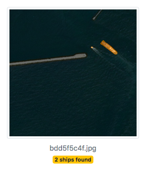

The challenge of the [Airbus Ship Detection Challenge competition](https://www.kaggle.com/c/airbus-ship-detection) was in building a model that detects all ships in satellite images as quickly as possible. For this, we choose a Dynamic Unet with (a pre-trained) ResNet34 backbone and applied a set of hacks. After training the model over a night, we achieved some remarkable performance (top 50 as of today). In addition, we made a tiny web application for demonstration purposes.

Tags: *Competition, Satellite Imagery, Ship Detection, Image Segmentation, Neural Networks, Transfer Learning, Python, fastai, Web App*

[Here is the notebook](https://nbviewer.jupyter.org/github/polakowo/mlprojects/blob/master/airbus-ship-segmentation/airbus-ship-segmentation.ipynb)

The web app can be deployed with
```
cd app
docker build -t ship-detection .
docker run -p 8000:8000 ship-detection
open http://localhost:8000
```


