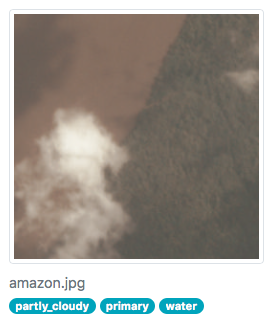

Fine-tuned ResNet50 for the [Planet: Understanding the Amazon from Space](https://www.kaggle.com/c/planet-understanding-the-amazon-from-space) competition.

The web app can be deployed with
```
cd app
docker build -t planet-amazon .
docker run -p 8000:8000 planet-amazon
open http://localhost:8000
```


